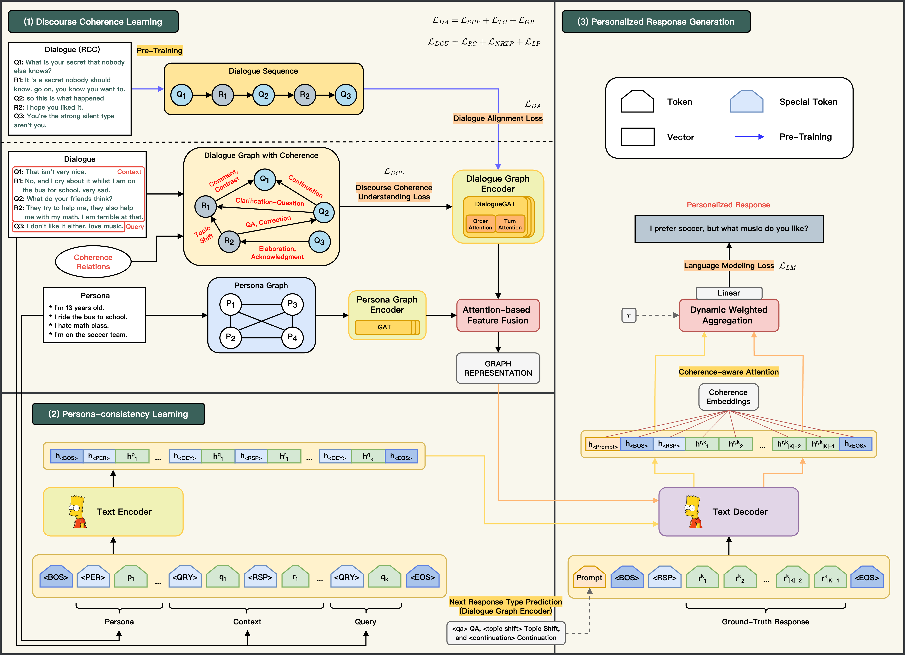
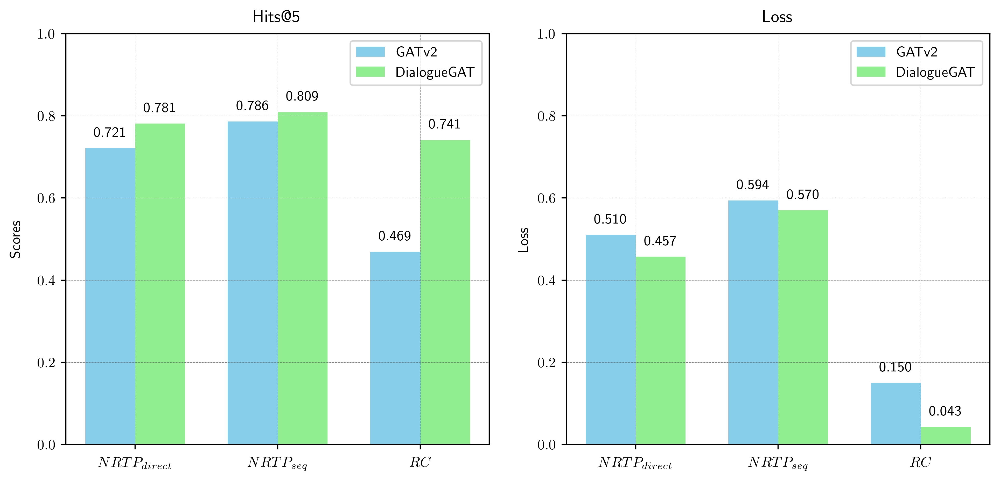
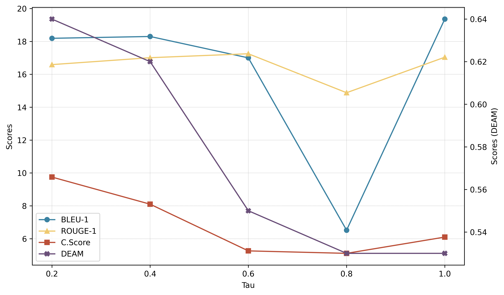
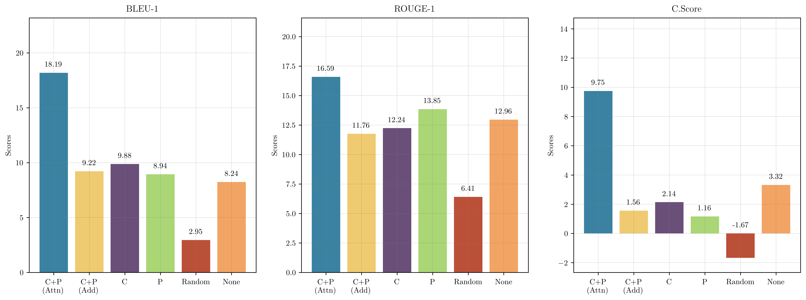

# From Persona to Person: Enhancing the Naturalness with Multiple Discourse Relations Graph Learning in Personalized Dialogue Generation



## Installation and Environment Setup

* Python: >=3.9
* Required packages: follow the `requirements.txt` file.

1. Clone this repository:

   ```bash
    git clone https://github.com/IKM-graduates/master_thesis_ChihHao_Hsu_P76114503.git
    cd master_thesis_ChihHao_Hsu_P76114503
   ```

1. Create a new conda environment and activate it:

   ```bash
   conda create -n mudi python=3.9
   conda activate mudi
   ```
2. Install the required packages:

   ```bash
   pip install -r requirements.txt
   ```

## Dataset Preparation

You could simply download the all dataset from the following link:
- [💾 Google Drive](https://drive.google.com/drive/folders/1gb6EACub9UJIX00OU_zRqhkdUre6gBIu?usp=drive_link)

You can also download the dataset manually and put it in the `dataset/RCC/` and `dataset/ConvAI2/` directories.

* **RCC**: We utilize the Reddit Coherence Chain (RCC) dataset, a large-scale chit-chat dialogue dataset designed for dialogue alignment in the pre-training phase of our Dialogue Graph Encoder. The RCC dataset can be accessed  [here](https://github.com/nouhadziri/THRED).

  * In our experiments, we use the 5-turn RCC dataset.
* **ConvAI2**: We utilize the ConvAI2 dataset, a personalized chit-chat dialogue dataset designed for personalized dialogue generation. The ConvAI2 dataset can be accessed [here](https://parl.ai/projects/convai2/).

  * In our experiments, we use the 'original' version of the ConvAI2 dataset. But you can also use the 'revised' versions of the ConvAI2 dataset.

  * We provide the coherence annotated ConvAI2 dataset in the `dataset/ConvAI2/llama3/` and  `dataset/ConvAI2/mixtral/` directories.


The `dataset` folder should be organized as follows:

```
.
├── dataset
│   ├── ConvAI2
│   │   ├── llama3
│   │   │    ├── train_self_original_coherence.json
│   │   │    └── valid_self_original_coherence.json
│   │   ├── mixtral
│   │   │    ├── train_self_original_coherence.json
│   │   │    └── valid_self_original_coherence.json
│   │   ├── train_self_original.json
│   │   └── valid_self_original.json
├── └── RCC
│       ├──reddit_conversations_v1.0_5turns
│       │   ├── reddit_conversations.5turns.train.txt
│       │   ├── reddit_conversations.5turns.test.txt
│       └── └── reddit_conversations.5turns.dev.txt
├── ...
```

## Data Preprocessing

1. Please convert the raw **RCC** training set and validation set to the JSON format by running the following code:

   `python src/data/parse.py -i  dataset/RCC/reddit_conversations_v1.0_5turns/reddit_conversations.5turns.train.txt -o dataset/RCC/reddit_conversations_v1.0_5turns/train.json --dataset rcc`

   | Argument                       | Explanation                                                                     |
   | ------------------------------ | ------------------------------------------------------------------------------- |
   | `-d`, `--dataset`          | Dataset name (convai2 or rcc). Choices are 'convai2', 'rcc'.**Required.** |
   | `-i`, `--input_file_path`  | Path to the input file. Only txt file is allowed.**Required.**            |
   | `-o`, `--output_file_path` | Path to save the converted file. Only json file is allowed.**Required.**  |

   When the **RCC** dataset is converted to the JSON format, the data format should be as follows:


   ```json
   {
       "dialogue": [
           "what is your secret that nobody else knows ?",
           "it 's a secret nobody should know .",
           "go on , you know you want to .",
           "so this is what happened - \" \" i hope you liked it .",
           "you 're the strong silent type are n't you ."
       ]
   }
   ```
2. We utilize the Sentence-Transformer as an encoder to extract contextualized global semantics from both utterances and personas, thereby initializing the node features.

   You can obtain the encoding dataset by running the following code:

   For **RCC** dataset:

   `python src/data/preprocess.py -d rcc -i dataset/RCC/reddit_conversations_v1.0_5turns/train.json -o dataset/RCC/reddit_conversations_v1.0_5turns/train.pkl`

   For **ConvAI2** dataset:

   `python src/data/preprocess.py -d convai2 -i dataset/ConvAI2/llama3/valid_self_original_coherence.json -o dataset/ConvAI2/llama3/valid_self_original_coherence.pkl`

   Please preprocess the training and validation sets respectively.

   | Argument                       | Explanation                                                                                      |
   | ------------------------------ | ------------------------------------------------------------------------------------------------ |
   | `-d`, `--dataset`          | Dataset name. Choices are 'convai2', 'rcc', 'daily_dialog'.**Required.**                   |
   | `-i`, `--input_file_path`  | Path to the input file.**Required.**                                                       |
   | `-o`, `--output_file_path` | Path to save the dataset  after preprocessing. Only pickle files are allowed.**Required.** |
   | `--augment`                  | Augment the dataset. Only for ConvAI2 dataset. Default is True.                                  |

## Dialogue Graph Encoder Training

### Pre-training

In order to pre-train the Dialogue Graph Encoder, you can run the following code:

```
sh scripts/pretrain_gnn.sh
```

### Fine-tuning

Please indicate the path to the pre-trained Dialogue Graph Encoder in the `--pretrained_model_path` argument. You can run the following code to fine-tune the Dialogue Graph Encoder:

```bash
sh scripts/train_gnn.sh
```

| Argument                           | Explanation                                                                                               |
| ---------------------------------- | --------------------------------------------------------------------------------------------------------- |
| `--data_dir`                     | Path to the dataset directory. Default is 'dataset/ConvAI2/'.                                             |
| `--processed_train_data_dir`     | Path to the processed training data directory.                                                            |
| `--processed_valid_data_dir`     | Path to the processed validation data directory.                                                          |
| `--train_data_name`              | Training data name under the data_dir. Default is 'train_self_original_coherence.pkl'.                    |
| `--valid_data_name`              | Validation data name under the data_dir. Default is 'valid_self_original_coherence.pkl'.                  |
| `--processed_train_data_name`    | Processed training data name under the processed_train_data_dir.                                          |
| `--processed_valid_data_name`    | Processed validation data name under the processed_valid_data_dir.                                        |
| `--ckpt_dir`                     | Checkpoint directory. Default is 'checkpoints/gnn'.                                                       |
| `--num_workers`                  | Number of workers. Default is 4.                                                                          |
| `--seed`                         | Random seed. Default is 42.                                                                               |
| `--wandb`                        | Use wandb or not. Default is False.                                                                       |
| `--wandb_entity`                 | Wandb entity.                                                                                             |
| `--wandb_project`                | Wandb project.                                                                                            |
| `-a`, `--wandb_run_name`       | Wandb run name.                                                                                           |
| `--process_mode`                 | Label (coherence relations) preprocess mode. Default is 'single_filter'.                                  |
| `--k_hop`                        | Keep how many k-hop neighbors. Default is 3.                                                              |
| `--reverse_edge`                 | Reverse edge or not. Default is False.                                                                    |
| `--directed`                     | Directed graph or not. Default is True.                                                                   |
| `--train_mode`                   | Model training mode. Choices are 'finetuning', 'pretraining'. Default is 'finetuning'.                    |
| `--do_inference`                 | Do inference only. Default is False.                                                                      |
| `--cpu`                          | Use CPU or not, if True, then use CPU, else use GPU (cuda). Default is False.                             |
| `--distributed`                  | Use distributed training or not. Default is False.                                                        |
| `--pretrained_model_path`        | Path to the pretrained model.                                                                             |
| `--pretrained_utterance_encoder` | Pretrained model for utterance/persona encoder. Choices are 'none', 'bert', 'roberta'. Default is 'none'. |
| `--layer_type`                   | Type of GNN encoder layers. Choices are 'GAT', 'GATv2', 'DialogueGAT'. Default is 'DialogueGAT'.          |
| `--num_layers`                   | Number of GNN encoder layers. Default is 2.                                                               |
| `--num_heads`                    | Number of attention heads if using GAT like layers. Default is 4.                                         |
| `--embedding_dim`                | Embedding dimension of GNN layers. Default is 512.                                                        |
| `--batch_size`                   | Batch size. Default is 512.                                                                               |
| `--epochs`                       | Number of epochs. Default is 100.                                                                         |
| `--lr`                           | Learning rate. Default is 0.0001.                                                                         |
| `--weight_decay`                 | Weight decay. Default is 0.01.                                                                            |
| `--optimizer`                    | Optimizer. Choices are 'adam', 'adamw', 'sgd', 'adagrad', 'rmsprop', 'sparse_adam'. Default is 'adamw'.   |
| `--coh_rel_cls_weight`           | Loss weight for coherence relations classification. Default is 1.0.                                       |
| `--link_prediction_weight`       | Loss weight for link prediction. Default is 1.0.                                                          |
| `--next_resp_type_direct_weight` | Loss weight for next response type prediction. Default is 1.0.                                            |
| `--next_resp_type_seq_weight`    | Loss weight for next response type prediction. Default is 1.0.                                            |
| `--endure_times`                 | The maximum endure epochs of loss increasing on validation. Default is 10.                                |

**Note:** If you encounter the error:
`FileNotFoundError: [Errno 2] No such file or directory: 'dataset/RCC/reddit_conversations_v1.0_5turns//processed_train/processed_train.pt', It is because the processed data is not found.` Please delete the `dataset/RCC/reddit_conversations_v1.0_5turns/processed_train/` directory and rerun the code. Other similar errors can be solved in the same way.

## Generator Training

Please indicate the path to the Dialogue Graph Encoder in the `--pretrained_dialogue_encoder_weights_path` argument.
You can run the following code to train the generator:

```bash
sh scripts/train_generator.sh
```

| Argument                                               | Explanation                                                                                               |
| ------------------------------------------------------ | --------------------------------------------------------------------------------------------------------- |
| `--data_dir`                                         | Path to the dataset directory. Default is 'dataset/ConvAI2/'.                                             |
| `--processed_train_data_dir`                         | Path to the processed training data directory.                                                            |
| `--processed_valid_data_dir`                         | Path to the processed validation data directory.                                                          |
| `--train_data_name`                                  | Training data name under the data_dir. Default is 'train_self_original_coherence.pkl'.                    |
| `--valid_data_name`                                  | Validation data name under the data_dir. Default is 'valid_self_original_coherence.pkl'.                  |
| `--processed_train_data_name`                        | Processed training data name under the processed_train_data_dir.                                          |
| `--processed_valid_data_name`                        | Processed validation data name under the processed_valid_data_dir.                                        |
| `--ckpt_dir`                                         | Checkpoint directory. Default is 'ckpts/generator/ConvAI2/'.                                              |
| `--num_workers`                                      | Number of workers. Default is 4.                                                                          |
| `--seed`                                             | Random seed. Default is 42.                                                                               |
| `--wandb`                                            | Use WandB or not. Default is False.                                                                       |
| `--wandb_entity`                                     | WandB entity.                                                                                             |
| `--wandb_project`                                    | WandB project.                                                                                            |
| `--wandb_run_name`, `-a`                           | WandB run name.                                                                                           |
| `--process_mode`                                     | Label (coherence relations) preprocess mode. Default is 'single_filter'.                                  |
| `--k_hop`                                            | Keep how many k-hop neighbors. Default is 3.                                                              |
| `--reverse_edge`                                     | Reverse edge or not. Default is False.                                                                    |
| `--directed`                                         | Directed graph or not. Default is True.                                                                   |
| `--train_mode`                                       | Model training mode. Choices are 'finetuning', 'pretraining'. Default is 'finetuning'.                    |
| `--do_inference`                                     | Do inference only. Default is False.                                                                      |
| `--cpu`                                              | Use CPU or not. If True, then use CPU, else use GPU (cuda). Default is False.                             |
| `--distributed`                                      | Use distributed training or not. Default is False.                                                        |
| `--pretrained_dialogue_encoder_weights_path`         | Path to the pretrained dialogue encoder weights.                                                          |
| `--pretrained_dialogue_encoder_encoder_weights_path` | Path to the pretrained dialogue encoder encoder weights.                                                  |
| `--pretrained_utterance_encoder`                     | Pretrained model for utterance/persona encoder. Choices are 'none', 'bert', 'roberta'. Default is 'none'. |
| `--layer_type`                                       | Type of GNN encoder layers. Choices are 'GAT', 'GATv2', 'RGAT', 'DialogueGAT'. Default is 'DialogueGAT'.  |
| `--num_layers`                                       | Number of GNN encoder layers. Default is 2.                                                               |
| `--num_heads`                                        | Number of attention heads if using GAT like layers. Default is 4.                                         |
| `--embedding_dim`                                    | Embedding dimension of GNN layers. Default is 512.                                                        |
| `--batch_size`                                       | Batch size. Default is 512.                                                                               |
| `--epochs`                                           | Number of epochs. Default is 100.                                                                         |
| `--lr`                                               | Learning rate. Default is 0.0001.                                                                         |
| `--weight_decay`                                     | Weight decay. Default is 0.01.                                                                            |
| `--optimizer`                                        | Optimizer. Choices are 'adam', 'adamw', 'sgd', 'adagrad', 'rmsprop', 'sparse_adam'. Default is 'adamw'.   |
| `--coh_rel_cls_weight`                               | Loss weight for coherence relations classification. Default is 1.0.                                       |
| `--link_prediction_weight`                           | Loss weight for link prediction. Default is 1.0.                                                          |
| `--next_resp_type_direct_weight`                     | Loss weight for next response type prediction. Default is 1.0.                                            |
| `--next_resp_type_seq_weight`                        | Loss weight for next response type prediction. Default is 1.0.                                            |
| `--endure_times`                                     | The maximum endure epochs of loss increasing on validation. Default is 10.                                |
| `--coherence_attn_strategy`   | Coherence attention strategy. Choices are 'SP', 'Emb', 'SP+Emb'. Default is 'SP+Emb'.                |
| `--graph_encoder_strategy`    | Graph encoder strategy. Choices are 'Attn', 'Add', 'C', 'P', 'Random', 'None'. Default is 'Attn'.   |

## Inference (Personzied Response Generation)

```
sh scripts/generate.sh -m <model_name_or_path>
```

| Argument                             | Explanation                                                                                               |
| ------------------------------------ | --------------------------------------------------------------------------------------------------------- |
| `-m`, `--model_name_or_path`     | The path or model name.**Required.**                                                                |
| `-t`, `--tokenizer_name_or_path` | The path or tokenizer name.**Required.**                                                            |
| `-o`, `--output_dir`             | The output directory where results are saved.**Required.**                                          |
| `--data_dir`                       | Path to the dataset directory. Default is 'dataset/ConvAI2/'.                                             |
| `--processed_data_dir`             | Path to the processed data directory.                                                                     |
| `--data_name`                      | Data file name. Default is 'valid_self_original_coherence.pkl'.                                           |
| `--processed_data_name`            | Processed data file name.                                                                                 |
| `--num_workers`                    | Number of workers. Default is 4.                                                                          |
| `--process_mode`                   | Label (coherence relations) preprocess mode. Default is 'single_filter'.                                  |
| `--k_hop`                          | Keep how many k-hop neighbors. Default is 3.                                                              |
| `--reverse_edge`                   | Reverse edge or not. Default is False.                                                                    |
| `--directed`                       | Directed graph or not. Default is True.                                                                   |
| `--batch_size`                     | Batch size. Default is 4.                                                                                 |
| `--pretrained_utterance_encoder`   | Pretrained model for utterance/persona encoder. Choices are 'none', 'bert', 'roberta'. Default is 'none'. |
| `--tau`                            | Temperature parameter for sampling in dialogue generation. Default is 0.2.                                |
| `--top_k_relations`                | Number of top relations to consider for generating responses. Default is 3.                               |
| `--coherence_attn_strategy`   | Coherence attention strategy. Choices are 'SP', 'Emb', 'SP+Emb'. Default is 'SP+Emb'.                |
| `--graph_encoder_strategy`    | Graph encoder strategy. Choices are 'Attn', 'Add', 'C', 'P', 'Random', 'None'. Default is 'Attn'.   |


## Evaluation

We have used the exisiting evaluation metrics to evaluate the generated responses. Please download the models and put them in the **root** directory.
* [NLI](https://github.com/934865517zjk/SimOAP): consistent_model/
* [BARTScore](https://github.com/neulab/BARTScore): bart_score.pth

The structure of the root directory should be as follows:

```
.
├── assets
├── dataset
├── scripts
├── src
├── consistent_model
├── bart_score.pth
├── ...
```

In order to evaluate the quality of the generated responses, you can run the following code:

```bash
sh scripts/evaluate.sh  -i <generated_responses_file_path> -o <output_csv_file_path>
```

* All the evaluation metrics are saved in the csv file.

| Argument                       | Explanation                                                 |
| ------------------------------ | ----------------------------------------------------------- |
| `-i`, `--input_file_path`  | Path to the data for evaluation.**Required.**         |
| `-o`, `--output_file_path` | Path where evaluation outputs are saved.**Required.** |

## Analysis
### The Effect of proposed DialogueGAT

To validate the performance of the proposed DialogueGAT compared with existing GNN methods in Dialogue Graph modeling, we analyze results in the Next Response Type Prediction (NRTP) and Coherence Relations Classification (RC) tasks on the validation set.

1. You can run the `train_gnn.sh` script and change the `GNN_LAYER_TYPE` variable to `GATv2` to train the GATv2 model, or `DialogueGAT` to train the DialogueGAT model:

    ```bash
    sh scripts/train_gnn.sh
    ```

    * We report the best results on validation set of using the GATv2 and DialogueGAT models.



### The Effect of τ Values in Dynamic Weighted Aggregation

1. You can run the `generate.sh` and change `TAU` variable to evaluate the effect of τ values in dynamic weighted aggregation:

    ```bash
    sh scripts/generate.sh -m <model_name_or_path>
    ```

2. After generating the responses, you can run the evaluation script [evaluate.sh](#Evaluation) to evaluate the generated responses.



### The Effect of Dialogue Graph Encoder

When training the Generator, we will use the Dialogue Graph Encoder to encode the dialogue graph, and get the coherence-aware dialogue embeddings. Thus, we would like to analyze the effectiveness of the Dialogue Graph Encoder and Attention-based Feature-fusion Strategy.

You can run the `train_generator.sh` script and change the `GRAPH_ENCODER_STRATEGY` variable to `Attn`, `Add`, `C`, `P`, `Random`, or `None` to train the generator with different strategies of the Dialogue Graph Encoder output:

```bash
sh scripts/train_generator.sh
```



### The Difference Strategy of Coherence-aware Attention
In our model, we propose two strategies for coherence-aware attention: SP and Emb. We analyze the performance of these two strategies in each evaluation metric (report in the main results).

#### Training the Generator
You can run the `train_generator.sh` script and change the `COHERENCE_ATTN_STRATEGY` variable to `SP`, `Emb`, or `SP+Emb` to train the generator with different strategies:

```bash
sh scripts/train_generator.sh
```

#### Inference (Personalized Response Generation)
When the inference stage, you also can change the `COHERENCE_ATTN_STRATEGY` variable to `SP`, `Emb`, or `SP+Emb` to generate responses with different attention strategies:

```bash
sh scripts/generate.sh -m <model_name_or_path>
```

